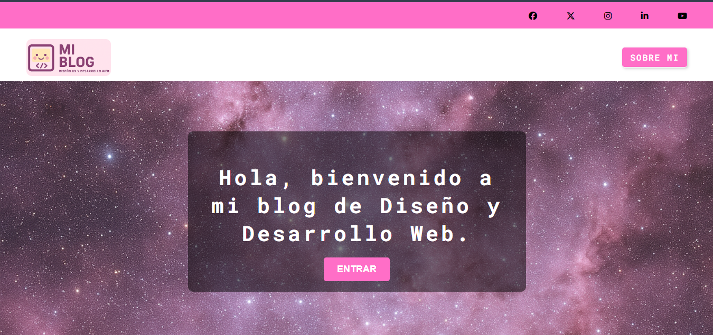

# 🌟 Mi Blog Personal: Diseño y Desarrollo Web 🌟

## Descripción del Proyecto

Este repositorio contiene el código fuente de mi blog personal, un espacio donde comparto mis conocimientos y experiencias en el mundo del **Diseño y Desarrollo Web**. Es un proyecto creado con el objetivo principal de aplicar y demostrar mis habilidades en **HTML5** y **CSS3**, prestando especial atención a la **maquetación responsiva** y el **diseño semántico**.

## Características Destacadas

* **HTML5 Semántico**: Estructura del contenido optimizada para la accesibilidad y el SEO, utilizando etiquetas como `<header>`, `<nav>`, `<main>`, `<section>`, y `<footer>`.
* **Diseño Responsivo**: Adaptado para una experiencia de usuario óptima en diferentes dispositivos (escritorio, tabletas y móviles) gracias al uso de **Media Queries**.
* **Maquetación Avanzada con CSS Grid y Flexbox**: Implementación de layouts complejos y flexibles utilizando las últimas técnicas de CSS Grid y Flexbox para una alineación y distribución eficientes del contenido.
* **Estilos Modernos y Personalizados**: Uso de propiedades CSS para crear un diseño visual atractivo y una interfaz de usuario intuitiva, incluyendo:
    * Manejo de **imágenes de fondo** con `background-size: cover` y `background-position: center`.
    * **Tipografías personalizadas** importadas con `@import url()`.
    * Centrado de elementos con `margin: 0 auto;` y alineación con `justify-content` y `align-items`.
    * Uso de **variables CSS** para la reutilización de estilos y un mantenimiento más sencillo.
    * Toques de diseño creativo, como la línea de emojis decorativa en el footer.
* **Organización del CSS**: Implementación de una metodología de nomenclatura para clases CSS como **BEM (Block, Element, Modifier)**, lo que facilita la modularidad y el mantenimiento del código.

## Tecnologías Utilizadas

* **HTML5**
* **CSS3**

## Cómo Visualizar el Proyecto

Puedes explorar el blog directamente desde tu navegador abriendo el archivo `index.html`.

**¡Próximamente disponible en GitHub Pages!**

## Contribución

Este es un proyecto personal, pero cualquier sugerencia o feedback es bienvenido.

## Autor

[Huguette Petite]
[www.linkedin.com/in/huguettea134711a3]
[Tu Enlace a red social]

---